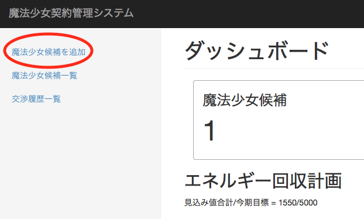

# 魔法少女登録画面

## 試験概要

魔法少女を新規に登録する画面の試験項目。

## 試験項目

### 新規登録画面表示

魔法少女情報更新画面を開いた際に、既存情報が期待通りに表示されることを確認する。

1. メニューから「魔法少女候補を追加」を押下する。

{width=600px}

#### 確認

表示された新規登録画面にて以下の点を確認する。

- [ ] 「名前」欄が空欄であること
- [ ] 「年齢」欄が0であること
- [ ] 「確度」欄がAであること
- [ ] 「見込み値」欄が0であること
- [ ] 「希望値」欄が0であること
- [ ] 「追加」ボタンが表示されていること

### 新規登録実行

1. フォームに以下の値を入力する。

| 項目     | 値     |
|:---------|:-------|
| 名前     | 巴マミ |
| 年齢     | 15     |
| 確度     | A      |
| 見込み値 | 200    |
| 希望値   | 10     |

#### 確認

以下の点を確認する。

- [ ] 魔法少女候補一覧画面に遷移すること
- [ ] 登録した魔法少女候補が一覧に表示されること
- [ ] 「魔法少女候補を登録しました」というメッセージが表示されること

### 新規登録実行（異常値）

1. フォームに以下の値を入力する。

| 項目     | 値       |
|:---------|:---------|
| 名前     | （空欄） |
| 年齢     | 9        |
| 確度     | A        |
| 見込み値 | 200      |
| 希望値   | 10       |

#### 確認

以下の点を確認する。

- [ ] 「魔法少女候補を更新できませんでした。もう一度お試し下さい。」というメッセージが表示されること
- [ ] 「年齢」欄が赤ハイライトされ、下部に「The provided value is invalid」とメッセージが表示されること
- [ ] 「魔法少女候補を登録しました」というメッセージが表示されること
